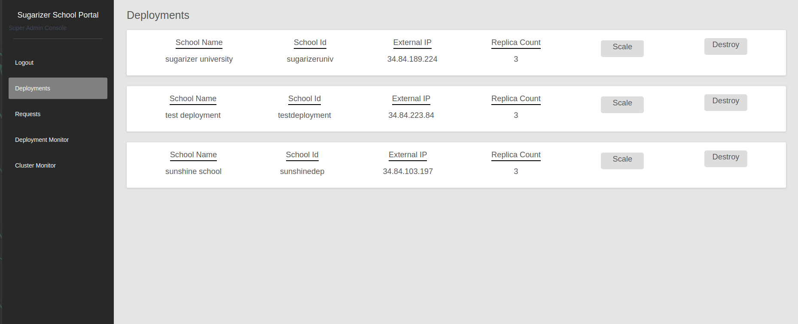
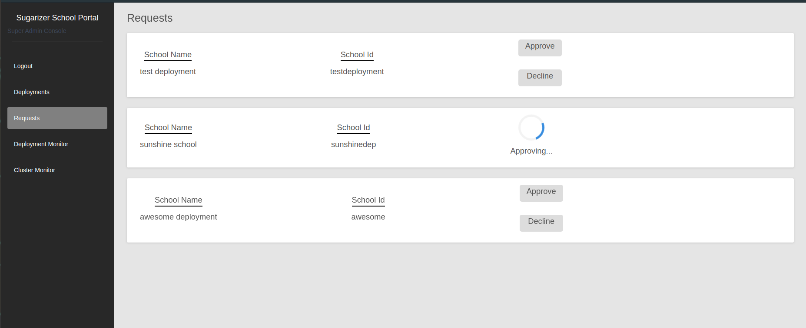
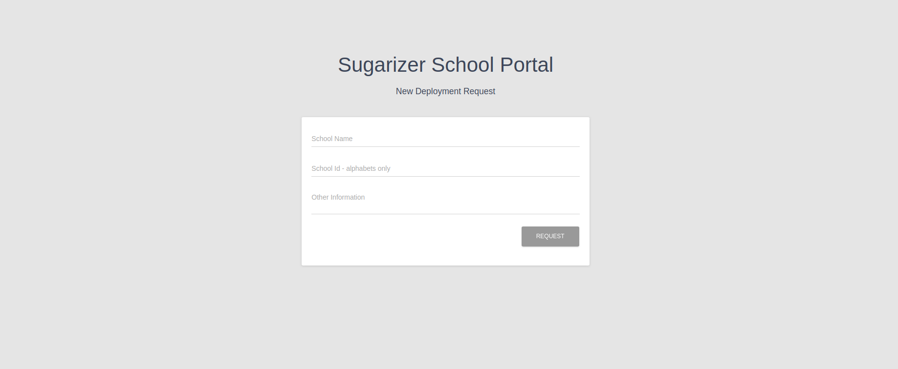

Sugarizer is the open source learning platform based on Sugar that began in the famous One Laptop Per Child project. Schools needed to setup sugarizer server which allows deployment of Sugarizer on a local server wchich exposes sugarizer as a web application locally and unlocks full potential of sugarizer through collaboration features. However setting up sugarizer server requires significant technocal knowledge.

**Sugarizer School Portal** is a platform for managing automated on-demand kubernetes deployments on the Google Kubernetes Engine(GKE) serving sugarizer server as a SaaS. This will enable small schools, orphanages or charities to set it up with barely any technical knowledge allowing them to bring great learning opportunities to more children.

The school will be able to request for a new deployment and the super admin can approve deployment requests. Upon approval of deployment request a new namespace will be created in the cluster and sugarizer server is deployed and the external ip is shared with the school using which it can access its deployment. The setup process and tasks for the super admin are kept very simple through incorporating automation using ansible packages so that the schools themselves or other small organizations can host a cluster themself.

Here is a link to a [video walkthrough demostrating the working of current build of sugarizer school portal](https://www.youtube.com/watch?v=CzCGf16DbzE&feature=youtu.be)

Sugarizer School Portal application can be divided into two parts
- Super admin console
- School console

**Steps for testing**
- Go the school console link and request for a new deployment, please note that school id field will only accept alphabets.
- Go to super admin console link then into requests page and approve the request, it will take a while for it to be approved
- When the request is approved go to deployments page to get the external ip, if the deployment is not accessible immideately on the external ip then wait for a while, it may take some time (upto 20 mins) for it to become accessible.
- You can login into the dashboard of the sugarizer deployment with a default account created for each deployment whose `userid = defaultuser` and `password = password`

**Features implemented till now** of Sugarizer School Portal -
- New deployment can be requested through the school console
- Deployment requests can be either approved or denied on the **Requests page** of super admin console
- Deployment's external ip can be seen, it can be destroyed on the **Deployments page** of super admin console

**Features to be implemented soom** -
- Scale button functionality in deployments page
- UI improvements

**Super Admin Console**
The Super Admin interacts with it to perform tasks like -
- Approve or decline deployment requests
- View Deployments and get more information about them
- Manage Resources and scale deployments

**Deployments Page - Super Admin Console** - Here is what the deployments page currently looks like -
The scale button is for testing purpose only and in the final application horizontal pod autoscaling will be setup to best utilize the amount of resource allocated for a deployment, this will ensure high availability.

**Requests Page - Super Admin Console** - Here is what the requests page currently looks like

**School console**
The school admin will be able to request for new deployment here.

